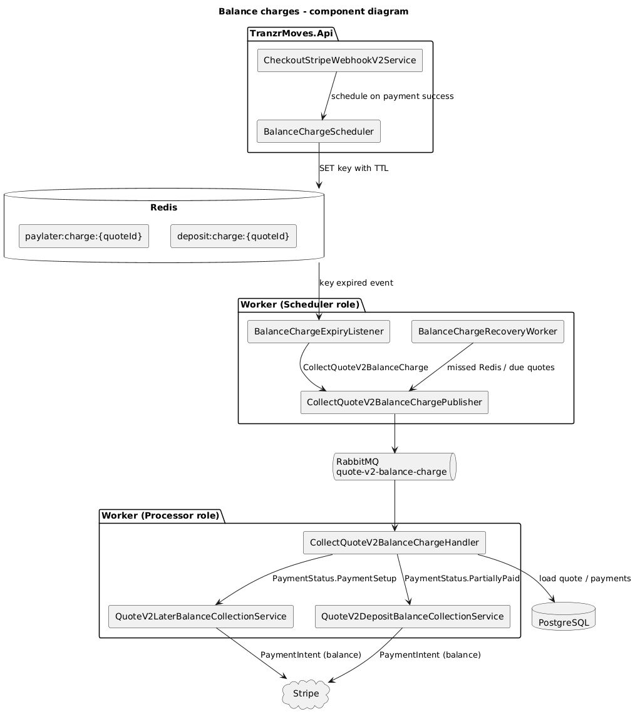
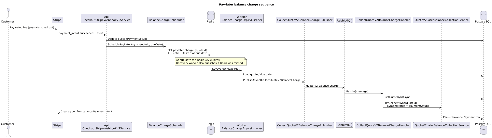
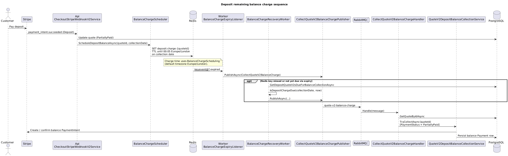

# Balance charges (pay-later and deposit remaining balance)

Tranzr Moves collects the **remaining balance** on a quote after the customer has completed an initial payment. Two checkout paths share the same messaging pipeline but use different Redis keys, schedules, and collection services.

| Path | Initial payment | Quote status when balance is due | Balance collection service |
|------|-----------------|----------------------------------|---------------------------|
| **Pay-later** | Setup fee (`PaymentType.Later`) | `PaymentSetup` | `QuoteV2LaterBalanceCollectionService` |
| **Deposit** | Deposit (`PaymentType.Deposit`) | `PartiallyPaid` | `QuoteV2DepositBalanceCollectionService` |

Both paths publish the same message (`CollectQuoteV2BalanceCharge`) to RabbitMQ queue `quote-v2-balance-charge`. The handler routes by `PaymentStatus`.

## Diagrams

### Component diagram



Source: [balance-charges-component.puml](balance-charges-component.puml)

### Sequence diagrams

**Pay-later**



Source: [balance-charges-sequence-pay-later.puml](balance-charges-sequence-pay-later.puml)

**Deposit remaining balance**



Source: [balance-charges-sequence-deposit.puml](balance-charges-sequence-deposit.puml)

---

## What each flow is

### Pay-later

The customer completes checkout with a **pay-later** option: a setup fee is charged now and the **full quote balance** is charged later on the agreed due date. After Stripe confirms the setup payment, the API schedules a Redis key that expires at the **start of the due date (UTC)**.

### Deposit remaining balance

The customer pays a **deposit** now; the **remaining amount** (`TotalCost - deposit`) is charged on the **move collection date** at **00:05** in the configured timezone (default `Europe/London`). After Stripe confirms the deposit, the API schedules a Redis key with that expiry instant.

---

## End-to-end pipeline

```
Stripe webhook (API) → BalanceChargeScheduler → Redis TTL key
    → key expiry OR recovery scan (Worker Scheduler)
    → CollectQuoteV2BalanceChargePublisher → RabbitMQ
    → CollectQuoteV2BalanceChargeHandler (Worker Processor)
    → Later or Deposit collection service → Stripe
```

### 1. Scheduling (API)

On successful Stripe webhooks, [`CheckoutStripeWebhookV2Service`](../../Src/TranzrMoves.Infrastructure/Services/CheckoutStripeWebhookV2Service.cs) calls [`BalanceChargeScheduler`](../../Src/TranzrMoves.Infrastructure/Services/BalanceChargeScheduler.cs):

| Event | Method | Redis key |
|-------|--------|-----------|
| Later payment succeeded | `SchedulePayLaterAsync` | `paylater:charge:{quoteId}` ([`PayLaterChargeKeys`](../../Src/TranzrMoves.Domain/Constants/PayLaterChargeKeys.cs)) |
| Deposit payment succeeded | `ScheduleDepositBalanceAsync` | `deposit:charge:{quoteId}` ([`DepositBalanceChargeKeys`](../../Src/TranzrMoves.Domain/Constants/DepositBalanceChargeKeys.cs)) |

Keys are set with `SET ... NX` and a TTL so duplicate webhooks do not reschedule.

### 2. Triggers (Worker — Scheduler role)

| Trigger | Component | When |
|---------|-----------|------|
| Redis key expiry | [`BalanceChargeExpiryListener`](../../Src/TranzrMoves.Worker/HostedServices/BalanceChargeExpiryListener.cs) | Subscribes to `__keyevent@*__:expired`; handles both key prefixes |
| Recovery poll | [`BalanceChargeRecoveryWorker`](../../Src/TranzrMoves.Worker/HostedServices/BalanceChargeRecoveryWorker.cs) | Interval from `PayLater:RecoveryIntervalMinutes`; catches missed Redis expiries |

Recovery queries:

- Pay-later: `GetPayLaterQuoteV2sDueForCollectionAsync` (UTC calendar day)
- Deposit: `GetDepositQuoteV2sDueForBalanceCollectionAsync` + [`BalanceChargeScheduling.IsDepositChargeDue`](../../Src/TranzrMoves.Infrastructure/Services/BalanceChargeScheduling.cs)

Both publish [`CollectQuoteV2BalanceCharge`](../../Src/TranzrMoves.Application/Messaging/CollectQuoteV2BalanceCharge.cs) via [`CollectQuoteV2BalanceChargePublisher`](../../Src/TranzrMoves.Infrastructure/Services/CollectQuoteV2BalanceChargePublisher.cs).

### 3. Messaging

Wolverine routes messages to RabbitMQ queue `quote-v2-balance-charge` ([`WolverineDependencyInjection`](../../Src/TranzrMoves.Infrastructure/DependencyInjection/WolverineDependencyInjection.cs)).

In production, **Scheduler** hosts publish only; **Processor** hosts consume. In local Development, `Worker:Role=All` runs both in one process (see [Worker README](../../Src/TranzrMoves.Worker/README.md)).

### 4. Collection (Worker — Processor role)

[`CollectQuoteV2BalanceChargeHandler`](../../Src/TranzrMoves.Application/Features/Checkout/CollectPayLater/CollectQuoteV2BalanceChargeHandler.cs) loads the quote and dispatches:

```csharp
quote.PaymentStatus switch
{
    PaymentStatus.PaymentSetup => laterBalanceCollectionService.TryCollectAsync(...),
    PaymentStatus.PartiallyPaid => depositBalanceCollectionService.TryCollectAsync(...),
    _ => skip
};
```

Collection services create or reuse a Stripe PaymentIntent for `PaymentType.Balance` and update Postgres.

---

## Worker roles

| Role | Redis listener | Recovery | RabbitMQ consumer |
|------|:--------------:|:--------:|:-----------------:|
| `Scheduler` | Yes | Yes | No |
| `Processor` | No | No | Yes |
| `All` (Development only) | Yes | Yes | Yes |

Configuration: [`WorkerHostConfiguration`](../../Src/TranzrMoves.Worker/WorkerHostConfiguration.cs).

Kubernetes deployment: [docs/pay-later-worker-kubernetes-deployment.md](../../docs/pay-later-worker-kubernetes-deployment.md).

---

## Configuration

| Setting | Purpose |
|---------|---------|
| `PayLater:RecoveryIntervalMinutes` | Recovery worker poll interval (default 30) |
| `PayLater:UseDurableMessaging` | Wolverine PostgreSQL outbox/inbox (default true in production) |
| `PayLater:DepositChargeTimeZone` | IANA zone for deposit charge at 00:05 (default `Europe/London`) |
| `ConnectionStrings:redis` | Scheduler only |
| `ConnectionStrings:rabbitmq` | Scheduler + Processor |
| Redis `notify-keyspace-events` | Must include `Ex` for expiry events |

---

## Local testing

See the root [README](../../README.md) for Docker, migrations, API, Worker, and Stripe CLI.

### Pay-later (fast path)

Manually expire a key (GUID **without dashes**):

```bash
docker exec tranzr-redis redis-cli SET "paylater:charge:YOUR_QUOTE_ID_NO_DASHES" "{\"quoteId\":\"...\"}" EX 2
```

### Deposit (fast path)

```bash
docker exec tranzr-redis redis-cli SET "deposit:charge:YOUR_QUOTE_ID_NO_DASHES" "{\"quoteId\":\"...\"}" EX 2
```

### Automated tests

| Test | Coverage |
|------|----------|
| `CollectQuoteV2BalanceChargeHandlerTests` | RabbitMQ → handler → pay-later collection |
| `DepositBalanceEndToEndTests.RedisExpiry_PublishesAndCollectsDepositBalance` | Redis expiry → deposit balance Stripe charge |

---

## Key source files

| Area | File |
|------|------|
| Handler | `Src/TranzrMoves.Application/Features/Checkout/CollectPayLater/CollectQuoteV2BalanceChargeHandler.cs` |
| Scheduler | `Src/TranzrMoves.Infrastructure/Services/BalanceChargeScheduler.cs` |
| Deposit timing | `Src/TranzrMoves.Infrastructure/Services/BalanceChargeScheduling.cs` |
| Later collection | `Src/TranzrMoves.Infrastructure/Services/QuoteV2LaterBalanceCollectionService.cs` |
| Deposit collection | `Src/TranzrMoves.Infrastructure/Services/QuoteV2DepositBalanceCollectionService.cs` |
| Expiry listener | `Src/TranzrMoves.Worker/HostedServices/BalanceChargeExpiryListener.cs` |
| Recovery | `Src/TranzrMoves.Worker/HostedServices/BalanceChargeRecoveryWorker.cs` |
