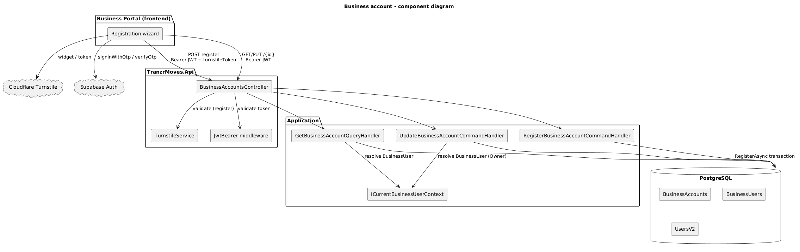
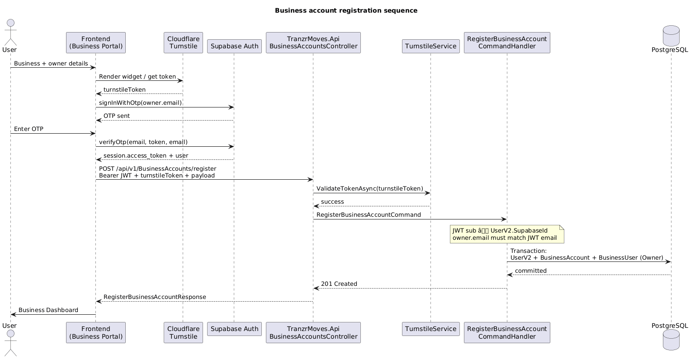
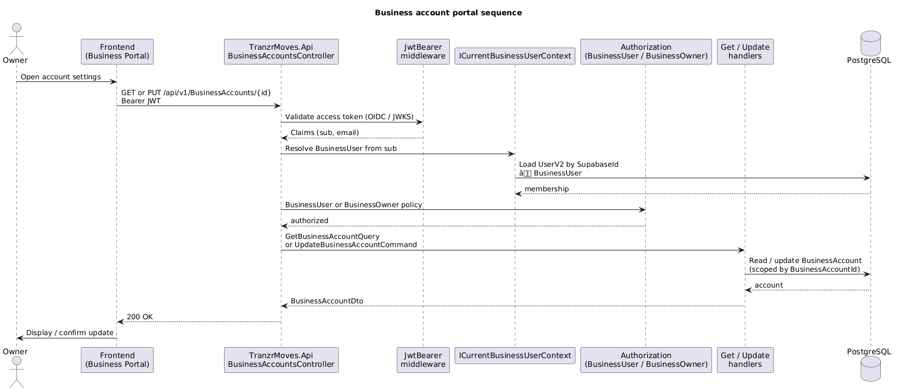

# Business account

Business accounts are the tenant boundary for the Tranzr Business Portal. Each account has one or more business users linked to app users (`UserV2`). MVP enforces one business user per app user via a unique index on `BusinessUsers.UserId`.

Requirements: [`projects_inbox/Tranzr_Business_Portal/Business_Account.md`](../../projects_inbox/Tranzr_Business_Portal/Business_Account.md)

---

## Two-layer signup

Business registration is **not** a single backend call that creates everything. The frontend wizard and Supabase Auth handle identity; the Tranzr API creates the tenant.

### Layer 1 — Supabase identity (frontend)

The initial owner does not exist in Supabase when the wizard starts. Supabase creates the auth user during OTP verification.

| Step | Action | Result |
|------|--------|--------|
| A | Collect business + owner details | Form state only |
| B | `signInWithOtp({ email: owner.email })` | OTP sent; `session` still null |
| C | `verifyOtp({ email, token, type: 'email' })` | Auth user created (if new); `session.access_token` issued |

**Note:** Supabase has no separate `signUpWithOtp` for email in JS. `signInWithOtp` with default `shouldCreateUser: true` is signup for new emails.

### Layer 2 — Tranzr tenant (backend)

After OTP, the frontend calls register with the JWT. The API **links** the existing Supabase user; it does **not** call `ISupabaseAuthAdminService` (that path is `Auth/Register` only).

Atomic Postgres transaction: `UserV2` + `BusinessAccount` + `BusinessUser` (Owner, Active).

### Who creates what

| Record | Created by | When |
|--------|------------|------|
| Supabase `auth.users` | Supabase | `verifyOtp` |
| JWT `access_token` | Supabase | `verifyOtp` |
| `UserV2` | Tranzr API | `POST .../register` |
| `BusinessAccount` | Tranzr API | Same call |
| `BusinessUser` (Owner) | Tranzr API | Same call |

---

## Diagrams

### Component diagram



Source: [business-account-component.puml](business-account-component.puml)

### Registration sequence



Source: [business-account-sequence-register.puml](business-account-sequence-register.puml)

### Portal sequence



Source: [business-account-sequence-portal.puml](business-account-sequence-portal.puml)

---

## API surface

| Method | Route | Auth | Purpose |
|--------|-------|------|---------|
| POST | `/api/v1/BusinessAccounts/register` | JWT + Turnstile | Create tenant + Owner |
| GET | `/api/v1/BusinessAccounts/{id}` | JWT + `BusinessUser` policy | Read account |
| PUT | `/api/v1/BusinessAccounts/{id}` | JWT + `BusinessOwner` policy | Update account |

Register is **not** a fully public endpoint. It requires a valid Supabase JWT and a Turnstile token. The handler enforces `owner.email` === JWT email and links `UserV2.SupabaseId` from JWT `sub`.

---

## Registration pipeline

```
Frontend wizard → Turnstile token
→ Supabase signInWithOtp → verifyOtp → access_token
→ POST register (Bearer + turnstileToken + payload)
→ TurnstileService → JwtBearer → RegisterBusinessAccountCommandHandler
→ BusinessAccountRepository.RegisterAsync (transaction)
```

---

## Portal auth pipeline

```
Bearer JWT → JwtBearer → ICurrentBusinessUserContext (sub → BusinessUser)
→ BusinessUser / BusinessOwner authorization policies
→ Get / Update handlers (tenant-scoped by BusinessAccountId)
```

---

## Data model

| Entity | Purpose |
|--------|---------|
| `BusinessAccount` | Tenant record (name, billing email/phone, billing address, status) |
| `BusinessUser` | Membership linking `UserV2` to `BusinessAccount` with role and status |
| `UserV2` | App user; `SupabaseId` links to Supabase `auth.users` |

Enums: `BusinessAccountStatus`, `BusinessUserStatus`, `BusinessUserRole` (Owner, etc.).

MVP: one `BusinessUser` per `UserV2` (unique index). Role and membership status live on `BusinessUser` only (BR-009).

`BillingAddress` is an owned type on `BusinessAccount`.

---

## Security layers (registration)

| Layer | Protects against | Where |
|-------|------------------|-------|
| Turnstile | Bot mass tenant creation | Register handler |
| Supabase OTP | Unverified email | Frontend `verifyOtp` |
| JWT validation | Forged register calls | `[Authorize]` + JwtBearer |
| `owner.email` === JWT email | Token/body mismatch | Register handler |
| Unique DB constraints | Duplicate tenants/users | Migration indexes |

---

## Configuration

| Variable | Used by |
|----------|---------|
| `SUPABASE_URL` | JWT issuer discovery (default issuer `{SUPABASE_URL}/auth/v1`) |
| `SUPABASE_JWT_ISSUER` | Optional override when issuer differs from default |
| `TURNSTILE_SECRET_KEY` | `TurnstileService` on register |

Frontend uses the Supabase publishable (anon) key only — never the service role key.

---

## Code map

| Area | Location |
|------|----------|
| Controller | [`BusinessAccountsController`](../../Src/TranzrMoves.Api/Controllers/BusinessAccountsController.cs) |
| Register handler | [`RegisterBusinessAccountCommandHandler`](../../Src/TranzrMoves.Application/Features/BusinessAccount/Register/RegisterBusinessAccountCommand.cs) |
| Get / Update | [`GetBusinessAccountQuery`](../../Src/TranzrMoves.Application/Features/BusinessAccount/Get/), [`UpdateBusinessAccountCommand`](../../Src/TranzrMoves.Application/Features/BusinessAccount/Update/) |
| Repositories | [`BusinessAccountRepository`](../../Src/TranzrMoves.Infrastructure/Respositories/BusinessAccountRepository.cs), [`BusinessUserRepository`](../../Src/TranzrMoves.Infrastructure/Respositories/BusinessUserRepository.cs) |
| JWT auth | [`SupabaseJwtAuthenticationExtensions`](../../Src/TranzrMoves.Infrastructure/Authentication/SupabaseJwtAuthenticationExtensions.cs) |
| Turnstile | [`TurnstileService`](../../Src/TranzrMoves.Infrastructure/Services/TurnstileService.cs) |
| Entities | [`BusinessAccount`](../../Src/TranzrMoves.Domain/Entities/BusinessAccount.cs), [`BusinessUser`](../../Src/TranzrMoves.Domain/Entities/BusinessUser.cs) |

---

## Deferred

- Admin suspend/activate HTTP endpoints (handlers exist; no public API yet)
- Team invitations and role management beyond Owner
- Turnstile on `GET`/`PUT` by id

---

## Related docs

- [README — Business account registration](../../README.md#business-account-registration) — env vars and quick setup
- [Requirements spec](../../projects_inbox/Tranzr_Business_Portal/Business_Account.md)
