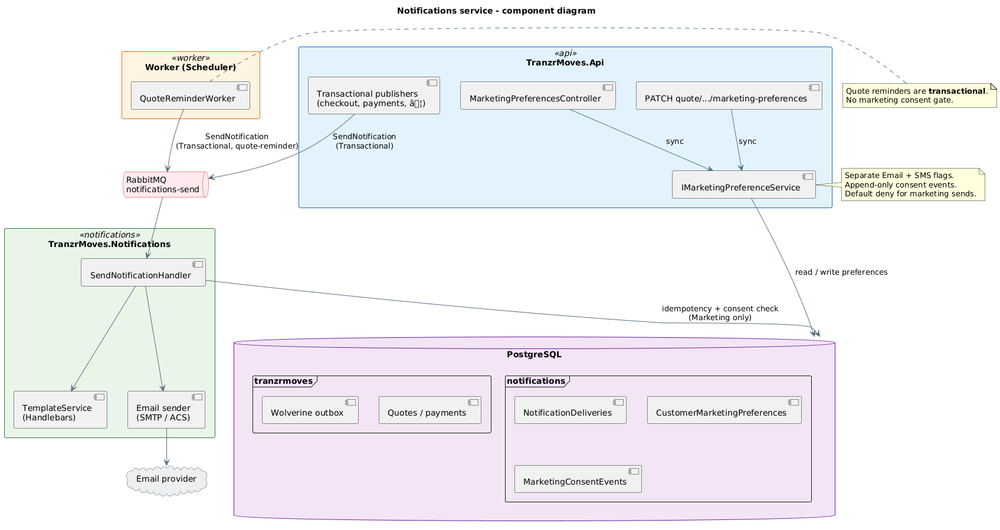
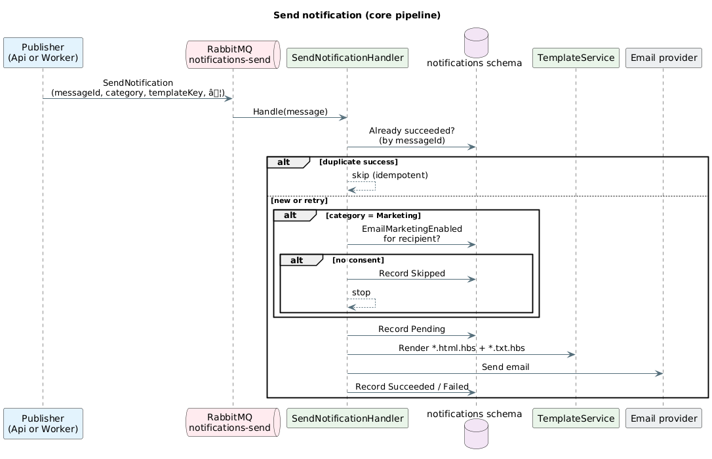
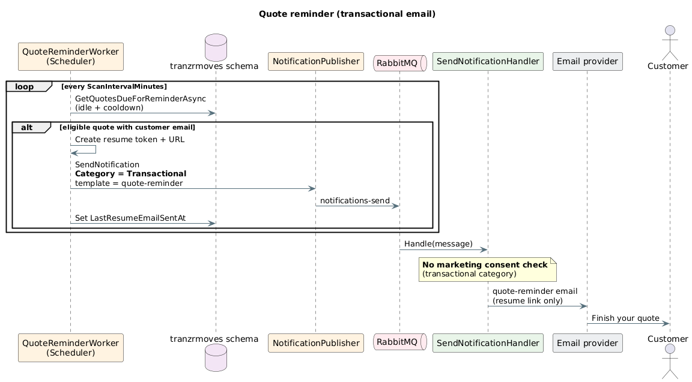
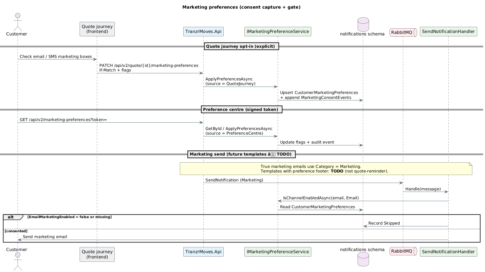

# Notifications service

Email is sent by **TranzrMoves.Notifications**, a separate host in this solution. The Api and Worker **do not** call the email provider directly — they publish `SendNotification` messages through Wolverine (durable outbox) to RabbitMQ.

## Email types

| Type | `Category` | Consent required? | Examples |
|------|------------|-------------------|----------|
| **Transactional** | `Transactional` | No | Payment confirmations, checkout emails, **quote reminders** |
| **Marketing** | `Marketing` | Yes (email channel) | Promotional campaigns — **templates TODO** |

Quote reminders are **transactional**: they nudge the customer to finish an in-progress quote and do **not** include unsubscribe or preference-centre links.

Marketing emails are blocked unless `CustomerMarketingPreferences.EmailMarketingEnabled = true` for the recipient (default deny).

---

## Diagrams

### Component diagram



Source: [notifications-component.puml](notifications-component.puml)

### Sequence diagrams

**Core send pipeline**



Source: [notifications-sequence-send.puml](notifications-sequence-send.puml)

**Quote reminder**



Source: [notifications-sequence-quote-reminder.puml](notifications-sequence-quote-reminder.puml)

**Marketing preferences**



Source: [notifications-sequence-marketing-preferences.puml](notifications-sequence-marketing-preferences.puml)

---

## Core pipeline

```
Api / Worker  →  Wolverine outbox (tranzrmoves)  →  RabbitMQ notifications-send
       →  SendNotificationHandler  →  Handlebars templates  →  SMTP (local) or ACS
       →  NotificationDeliveries audit log
```

| Piece | Role |
|-------|------|
| **Publishers** (Api, Worker) | Build `SendNotification`; stable `MessageId` for idempotency |
| **RabbitMQ** | Queue `notifications-send` |
| **Notifications host** | Consent gate (marketing only), render template, send, record delivery |

### `SendNotification` contract

| Field | Purpose |
|-------|---------|
| `MessageId` | Idempotency key (caller-generated, stable across retries) |
| `CorrelationId` | Business id (quote id, payment id, …) |
| `Category` | `Transactional` or `Marketing` |
| `TemplateKey` | Maps to `*.html.hbs` / `*.txt.hbs` under Notifications.Infrastructure |

---

## Quote reminders

The Worker **Scheduler** role runs [`QuoteReminderWorker`](../../Src/TranzrMoves.Worker/HostedServices/QuoteReminderWorker.cs):

1. Find incomplete quotes idle longer than `IdleHoursBeforeReminder` and outside `ReminderCooldownDays`.
2. Build a resume URL (signed token → frontend).
3. Publish **transactional** `quote-reminder` to `notifications-send`.
4. Set `QuoteV2.LastResumeEmailSentAt`.

No marketing preference check. Template: `quote-reminder` (resume CTA only).

| Setting (`QuoteReminders`) | Default |
|----------------------------|---------|
| `Enabled` | `true` |
| `ScanIntervalMinutes` | `60` |
| `IdleHoursBeforeReminder` | `24` |
| `ReminderCooldownDays` | `7` |
| `FrontendBaseUrl` | `http://localhost:3000` |
| `ResumeTokenLifetimeDays` | `30` |

---

## Marketing preferences

Consent lives in the **notifications** schema (not the monolith). The Api calls [`IMarketingPreferenceService`](../../Src/TranzrMoves.Notifications.Application/Services/IMarketingPreferenceService.cs) synchronously — there is no consent queue.

### Data model

| Table | Purpose |
|-------|---------|
| `CustomerMarketingPreferences` | Current Email / SMS flags per normalized email (default `false`) |
| `MarketingConsentEvents` | Append-only audit (`Granted` / `Withdrawn`, channel, source) |

### How consent is captured

| Source | Entry point |
|--------|-------------|
| Quote journey | `PATCH /api/v2/quote/{quoteId}/marketing-preferences` (explicit opt-in; **not** on email capture alone) |
| Preference centre | `GET/PUT /api/v2/marketing-preferences` with signed token (`X-Preference-Token` on PUT) |
| One-click unsubscribe | `GET /api/v2/marketing-preferences/unsubscribe/email?token=` (email channel only) |

Saving email/phone on a quote does **not** opt the customer into marketing.

### Marketing send gate

When `Category = Marketing`, `SendNotificationHandler` calls `IsChannelEnabledAsync` before sending. Missing row or disabled flag → delivery recorded as **Skipped**.

> **TODO:** Add dedicated marketing email templates with a shared footer partial (Manage preferences + Unsubscribe). `quote-reminder` is transactional and will not use that footer.

---

## Database

Same Postgres database (`tranzr` locally). Separate schemas:

| Schema | Owner | Contents |
|--------|--------|----------|
| `tranzrmoves` | Monolith | Quotes, payments, Wolverine **outbox** |
| `notifications` | Notifications host | Deliveries, marketing preferences + events, Wolverine **inbox** |

Connection string: `ConnectionStrings:TranzrMovesDatabaseConnection` (shared).

```bash
dotnet ef database update \
  --project Src/TranzrMoves.Notifications.Infrastructure \
  --startup-project Src/TranzrMoves.Notifications
```

(`docker compose up` can apply notifications migrations via `notifications-db-migrator`.)

---

## Configuration

| Setting | Where |
|---------|--------|
| `ConnectionStrings:TranzrMovesDatabaseConnection` | Api, Worker, Notifications |
| `ConnectionStrings:rabbitmq` | Api, Worker, Notifications |
| `Notifications:EmailProvider` | Notifications (`Acs` or `Smtp`) |
| `Notifications:UseDurableMessaging` | `true` in prod; `false` in tests |
| `QuoteReminders:*` | Worker Scheduler |

---

## Observability

Meter: `TranzrMoves.Notifications`

| Metric | Meaning |
|--------|---------|
| `notifications.delivery.succeeded` | Email sent |
| `notifications.delivery.failed` | Send failed (retry / DLQ) |
| `notifications.delivery.skipped` | Duplicate, consent block, unsupported channel |
| `notifications.marketing.sent` | Marketing email sent |
| `notifications.marketing.blocked` | Marketing blocked by consent |

Monitor the `notifications-send` dead-letter queue in RabbitMQ.

---

## Local development

```bash
docker compose up -d
dotnet ef database update --project Src/TranzrMoves.Infrastructure --startup-project Src/TranzrMoves.Api
dotnet run --project Src/TranzrMoves.Notifications
```

| Service | URL |
|---------|-----|
| Notifications health | `http://localhost:8081/healthz` |
| SMTP UI (local) | `http://localhost:8025` |

Worker Scheduler (quote reminders): `Worker:Role=Scheduler` or `All` in Development.
